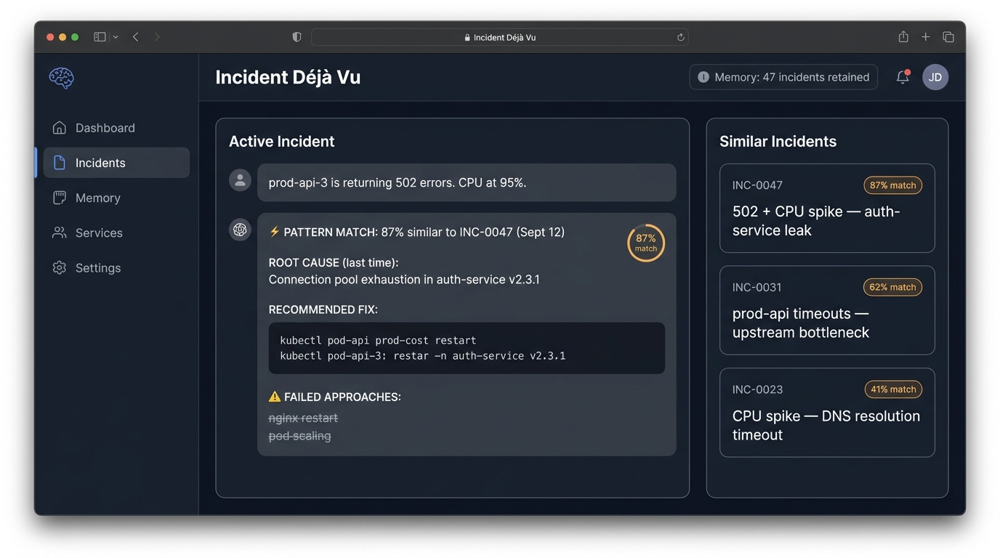
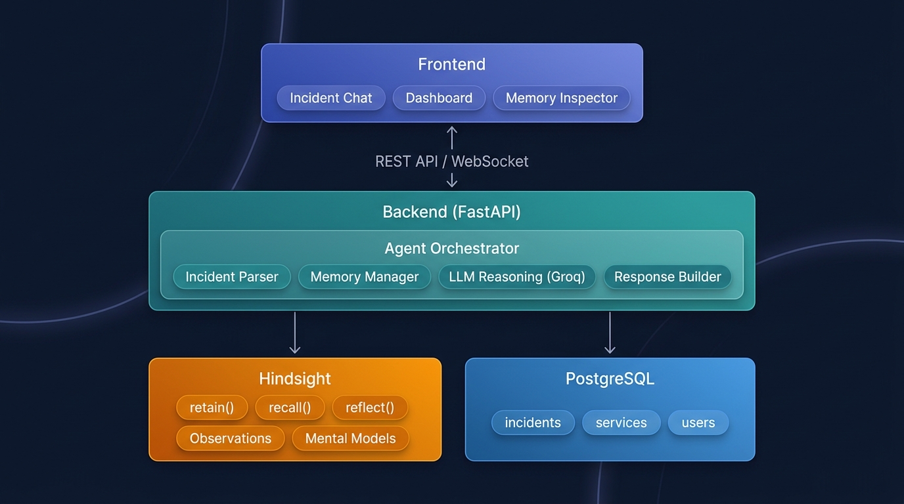
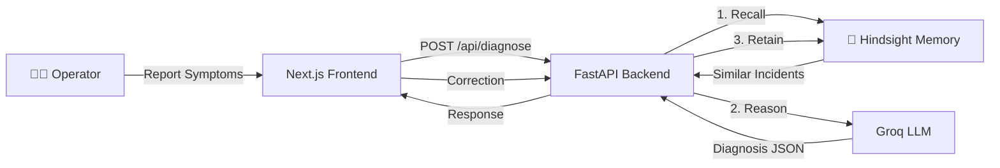

<div align="center">
  
**An AI incident responder that learns from every outage, turning yesterday's failed approaches into today's immediate fixes.**

[](https://github.com/kanojiaatharva/HWH_Hindsight/actions)
[](https://www.python.org/downloads/)
[](https://nextjs.org/)
[](LICENSE)
[](https://hindsight.vectorize.io/)

*Built for [Hack with Hyderabad 3.0](https://hackwithhyderabad.in/) — Hindsight Track*

---

</div>

## 📖 Table of Contents

- [The Problem](#-the-problem)
- [The Solution](#-the-solution)
- [Why Hindsight is Essential](#-why-hindsight-is-essential)
- [Demo — Memory ON vs OFF](#-demo--memory-on-vs-off)
- [Architecture](#-architecture)
- [Tech Stack](#-tech-stack)
- [Quick Start](#-quick-start)
- [API Reference](#-api-reference)
- [Testing](#-testing)
- [Project Structure](#-project-structure)
- [Documentation](#-documentation)
- [Contributing](#-contributing)
- [License](#-license)

---

## 🔥 The Problem

When production breaks at 2 AM, on-call engineers waste critical minutes:

| What Happens Today | The Real Cost |
|---|---|
| Engineer tries restarting nginx | Symptoms return in 10 minutes |
| Scales pods to 5 replicas | Bottleneck was upstream, not compute |
| Checks runbook from 6 months ago | Steps are outdated, service renamed |
| Asks in Slack "has anyone seen this?" | Senior who fixed it left the company |

> **The institutional knowledge of how to fix production incidents walks out the door every time an engineer changes teams or leaves. Runbooks get stale. Slack threads scroll past. And the same "quick fixes" get tried and fail for the same reasons, incident after incident.**

---

## 💡 The Solution

Incident Déjà Vu is a **memory-first incident response agent** built on [Hindsight](https://hindsight.vectorize.io/). It doesn't just read documentation — it **remembers** what actually worked (and what failed) during past incidents.

### The Memory Lifecycle

```
1. UNDERSTAND  →  Agent receives symptoms (e.g., "502 errors on prod-api")
2. RECALL      →  Queries Hindsight for semantically similar past incidents
3. REASON      →  LLM combines live symptoms with recalled experiences
4. ACT         →  Presents root cause + fix + "DO NOT TRY" warnings
5. RETAIN      →  User corrections are stored back, updating the agent's memory
```

### The Key Innovation: "Failed Approaches" Warning

Most AI tools tell you what *to* do. Incident Déjà Vu also tells you what ***not*** to do — based on approaches that failed in past incidents:

```
⚠️ DO NOT TRY (Based on past failures):
  ✗ Restarting nginx — symptoms returned in ~10 min
  ✗ Scaling prod-api pods — bottleneck was upstream
```

This single feature can save 15–30 minutes per incident by preventing engineers from repeating past mistakes.

---

## 🧩 Why Hindsight is Essential

| Without Hindsight | With Hindsight |
|---|---|
| Generic LLM advice: "Check the logs" | Specific: "This matches INC-0047 — connection pool exhaustion" |
| No historical context | Recalls exact past incident with 87% confidence |
| No failed approach warnings | "DO NOT restart nginx — it failed last time" |
| Stateless — forgets everything | Longitudinal learning across weeks/months |
| A chatbot | An evolving, organizational intelligence platform |

> **Remove Hindsight → Core functionality breaks.** The "Failed Approaches" feature, pattern matching, and correction loop all depend entirely on persistent agent memory.

---

## 🎬 Demo — Memory ON vs OFF

The UI includes a **Memory ON/OFF toggle** that instantly demonstrates Hindsight's value:

### Memory OFF (Generic LLM)


- ❌ No pattern match found
- ❌ Generic advice: "Check logs and metrics"
- ❌ No failed approach warnings
- ❌ 0% confidence

### Memory ON (Hindsight-Powered)
- ✅ **PATTERN MATCH: 87% similar** to INC-0047
- ✅ Root cause: "Connection pool exhaustion in auth-service"
- ✅ Exact fix: `kubectl rollout restart deploy/sidecar-proxy -n prod`
- ✅ **DO NOT TRY**: Restarting nginx, Scaling prod-api pods
- ✅ Correction loop: feedback is retained for future incidents

> **Demo Flow:** See [`docs/DEMO_SCRIPT.md`](docs/DEMO_SCRIPT.md) for the step-by-step judge presentation script.

---

## 🏗 Architecture





For detailed architecture documentation with sequence diagrams, data flow, and fallback mechanisms:
→ **[`docs/ARCHITECTURE.md`](docs/ARCHITECTURE.md)**

---

## ⚙️ Tech Stack

| Layer | Technology | Purpose |
|-------|-----------|---------|
| **Frontend** | Next.js 16, React 19, TailwindCSS, Lucide Icons | Incident Workspace UI |
| **Backend** | FastAPI, Python 3.11, Pydantic v2 | API gateway & agent orchestration |
| **Memory** | [Hindsight Cloud API](https://hindsight.vectorize.io/) | Persistent agent memory (retain/recall) |
| **Intelligence** | [Groq](https://groq.com/) (Llama-3.3-70b-versatile) | Fast LLM reasoning with structured JSON output |
| **DevOps** | Docker, Docker Compose, GitHub Actions CI | Containerization & automated testing |
| **Testing** | pytest, Ruff | 25+ tests, linting, format checks |

---

## 🚀 Quick Start

### Option 1: Docker (Recommended)

```bash
git clone https://github.com/kanojiaatharva/HWH_Hindsight.git
cd HWH_Hindsight

# Configure API keys
cp backend/.env.example backend/.env
# Edit backend/.env with your GROQ_API_KEY and HINDSIGHT_API_KEY

# Start everything
docker compose up --build
```

Open **http://localhost:3000** — the Incident Workspace is ready.

### Option 2: Local Development

**Prerequisites:** Python 3.10+, Node.js 18+

```bash
# 1. Backend
cd backend
python -m venv venv
.\venv\Scripts\Activate.ps1        # Windows
# source venv/bin/activate          # Linux/Mac
pip install -r requirements.txt
cp .env.example .env
# Edit .env → add GROQ_API_KEY and HINDSIGHT_API_KEY
uvicorn main:app --reload --port 8000

# 2. Frontend (new terminal)
cd frontend
npm install
npm run dev
```

Open **http://localhost:3000** to access the Incident Workspace.

> **Note:** The system works **without API keys** using the built-in local fallback mode — perfect for demos.

### Option 3: PM2 (Both services)

```bash
npm install -g pm2
pm2 start ecosystem.config.cjs
pm2 logs   # View output
```

---

## 📡 API Reference

| Endpoint | Method | Description |
|----------|--------|-------------|
| `/api/health` | GET | Health check with version info |
| `/api/incidents` | GET | List all incidents |
| `/api/incidents/{id}` | GET | Get specific incident |
| **`/api/diagnose`** | **POST** | **Core: Diagnose with memory-powered context** |
| `/api/feedback` | POST | Submit correction → retained in memory |
| `/api/incidents/{id}/resolve` | POST | Resolve & retain experience |
| `/api/demo/reset` | POST | Reset demo state |
| `/api/demo/seed` | POST | Seed demo memories |

> **Full API docs:** [`docs/API_REFERENCE.md`](docs/API_REFERENCE.md) | Interactive: `http://localhost:8000/docs`

---

## 🧪 Testing

```bash
cd backend

# Run all tests
pytest tests/ -v

# Run with coverage
coverage run -m pytest tests/ -v
coverage report

# Lint
ruff check .
ruff format --check .
```

**Test coverage includes:**
- ✅ Health check & incident CRUD endpoints
- ✅ Diagnosis with memory ON vs OFF
- ✅ Feedback loop (positive, negative, correction)
- ✅ Incident resolution & memory retention
- ✅ Data sanitization (API keys, tokens, IPs)
- ✅ Hindsight client initialization & recall
- ✅ Edge cases (empty input, long descriptions)
- ✅ Pydantic model validation

---

## 📁 Project Structure

```
HWH_Hindsight/
├── backend/
│   ├── main.py                 # FastAPI application & routes
│   ├── llm_agent.py            # LLM orchestration (Groq)
│   ├── hindsight_client.py     # Hindsight API client (retain/recall)
│   ├── models.py               # Pydantic v2 data models
│   ├── seed_data.py            # Realistic seed incidents
│   ├── requirements.txt        # Production dependencies
│   ├── requirements-dev.txt    # Dev/test dependencies
│   ├── Dockerfile              # Backend container
│   └── tests/
│       └── test_agent.py       # Comprehensive test suite (25+ tests)
│
├── frontend/
│   ├── src/app/
│   │   ├── page.tsx            # Main Incident Workspace UI
│   │   ├── layout.tsx          # Root layout
│   │   └── globals.css         # Global styles
│   ├── package.json            # Frontend dependencies
│   └── Dockerfile              # Frontend container
│
├── docs/
│   ├── ARCHITECTURE.md         # System design & memory lifecycle (with diagrams)
│   ├── API_REFERENCE.md        # Complete API documentation
│   ├── PRD.md                  # Product Requirements Document
│   ├── DEMO_SCRIPT.md          # Step-by-step judge demo script
│   ├── IDEATION_ANALYSIS.md    # Full ideation research (66K words)
│   └── JUDGE_REVIEW.md         # Self-assessment against judging criteria
│
├── assets/
│   ├── architecture_diagram.jpg
│   ├── dashboard_screenshot.jpg
│   └── terminal_screenshot.jpg
│
├── .github/workflows/
│   └── ci.yml                  # GitHub Actions CI pipeline
│
├── docker-compose.yml          # One-command deployment
├── ecosystem.config.cjs        # PM2 process management
├── article.md                  # Technical deep-dive article
├── CONTRIBUTING.md             # Contribution guidelines
├── CODE_OF_CONDUCT.md          # Contributor Covenant
├── SECURITY.md                 # Security policy & design
├── CHANGELOG.md                # Development history
├── LICENSE                     # MIT License
└── README.md                   # ← You are here
```

---

## 📚 Documentation

| Document | Description |
|----------|-------------|
| [`docs/ARCHITECTURE.md`](docs/ARCHITECTURE.md) | System design, memory lifecycle, sequence diagrams, fallback mechanisms |
| [`docs/API_REFERENCE.md`](docs/API_REFERENCE.md) | Full API documentation with request/response examples |
| [`docs/PRD.md`](docs/PRD.md) | Product vision, target persona, key features |
| [`docs/DEMO_SCRIPT.md`](docs/DEMO_SCRIPT.md) | 3-phase demo script for judge presentations |
| [`docs/IDEATION_ANALYSIS.md`](docs/IDEATION_ANALYSIS.md) | Complete ideation research — 20 concepts evaluated, memory necessity analysis |
| [`docs/JUDGE_REVIEW.md`](docs/JUDGE_REVIEW.md) | Self-assessment against hackathon judging criteria |
| [`article.md`](article.md) | Technical article: "Hindsight Told Me Not to Restart Nginx This Time" |
| [`CHANGELOG.md`](CHANGELOG.md) | Version history and development progression |
| [`SECURITY.md`](SECURITY.md) | Security design principles and recommendations |

---

## 🤝 Contributing

Contributions are welcome! Please see [`CONTRIBUTING.md`](CONTRIBUTING.md) for guidelines.

## 📄 License

This project is licensed under the MIT License — see [`LICENSE`](LICENSE) for details.

---

<div align="center">

**Built with 🧠 [Hindsight](https://hindsight.vectorize.io/) | ⚡ [Groq](https://groq.com/) | 🚀 [Next.js](https://nextjs.org/) | 🐍 [FastAPI](https://fastapi.tiangolo.com/)**

*Hack with Hyderabad 3.0 — Hindsight Track*

</div>
