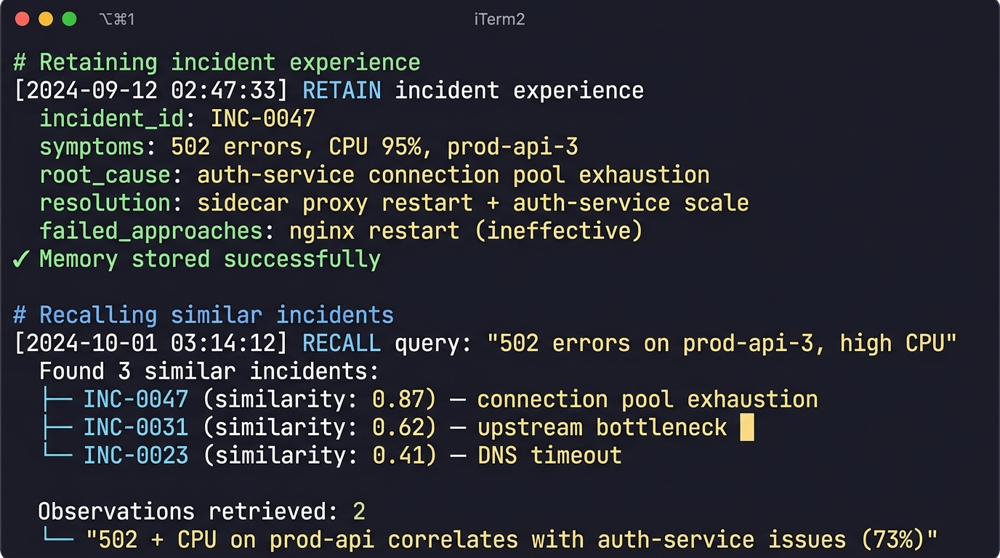

# Hindsight Told Me Not to Restart Nginx This Time

Every on-call engineer has lived this moment: production alert fires at 2 AM, you stare at a wall of logs, and somewhere in the back of your mind you think *I've seen this exact failure before*. The fix is buried in a post-mortem from three months ago that nobody bookmarked, or in a Slack thread that's long since scrolled past. So you start from scratch. Again.

I got tired of that loop. So I built an incident response agent that actually remembers — not just the current conversation, but every incident my team has ever resolved. What worked, what didn't, and why. The result is a system where the agent's first response to a new alert isn't generic troubleshooting advice — it's "this looks like that connection pool issue from September, and last time restarting nginx made it worse."

## What the System Does

The core idea is simple: every time we resolve a production incident, the agent retains the full experience — symptoms, root cause, resolution steps, and critically, what we tried that *failed*. When a new incident comes in, the agent recalls similar past incidents and uses that history to guide its diagnosis.

The architecture has three layers. A Next.js frontend gives operators a chat interface and an incident dashboard. A FastAPI backend handles the agent orchestration — parsing incident reports, managing memory operations, and coordinating LLM reasoning. And [Hindsight](https://github.com/vectorize-io/hindsight) sits underneath as the persistent memory layer, storing and retrieving incident experiences across sessions, days, and months.

The key insight that shaped the whole design: incidents don't repeat exactly, but they repeat in *patterns*. The same services tend to fail in similar ways. The same misconfigurations produce the same symptoms. And the same "quick fixes" get attempted and fail for the same reasons. A system that can match these patterns across dozens of past incidents is genuinely useful in ways that a runbook or a chatbot never will be.


## The Memory Pipeline: Where Hindsight Does the Heavy Lifting

The most interesting engineering problem in this project wasn't the LLM integration or the frontend — it was designing the memory lifecycle. When an incident gets resolved, we don't just dump the conversation into storage. We extract structured experience records and feed them to Hindsight through its `retain` API.

Here's the core of the retention flow:

```python
async def retain_incident_experience(incident: ResolvedIncident):
    """Store a resolved incident as a retrievable memory in Hindsight."""
    experience = {
        "incident_id": incident.id,
        "symptoms": incident.symptoms,
        "affected_services": incident.services,
        "root_cause": incident.root_cause,
        "resolution_steps": incident.resolution,
        "failed_approaches": incident.what_didnt_work,
        "time_to_resolve": incident.ttr_minutes,
        "severity": incident.severity,
        "environment": incident.environment,
    }

    sanitized = sanitize_sensitive_data(experience)

    await hindsight_client.retain(
        content=format_experience_narrative(sanitized),
        metadata={"incident_id": incident.id, "services": incident.services},
    )
```

Two things worth noting here. First, we run a sanitization pass before anything hits Hindsight. Incident logs are full of API keys, internal IPs, and occasionally passwords that someone pasted into a Slack thread. We strip all of that before retention. Second, we convert the structured data into a narrative format before storing it — not because Hindsight requires it, but because the recall quality is noticeably better when memories read like natural descriptions of what happened rather than raw JSON blobs.

The retrieval side is where the magic happens. When a new incident comes in, we build a context string from the operator's description and call Hindsight's `recall` API:

```python
async def diagnose_with_memory(incident_report: str, services: list[str]):
    """Retrieve relevant past incidents and generate a diagnosis."""
    recalled = await hindsight_client.recall(
        query=incident_report,
        namespace="incidents",
    )

    prompt = build_diagnosis_prompt(
        current_incident=incident_report,
        similar_incidents=recalled.memories,
        affected_services=services,
    )

    response = await llm.chat(
        model="qwen/qwen3-32b",
        messages=[{"role": "system", "content": DIAGNOSIS_SYSTEM_PROMPT},
                  {"role": "user", "content": prompt}],
    )
    return parse_diagnosis(response)
```

What makes this different from RAG is subtle but important. [Hindsight](https://hindsight.vectorize.io/) doesn't just retrieve similar text — it maintains what the docs call "mental models" and "observations." After enough incidents involving the same service, Hindsight synthesizes higher-order patterns automatically. So when I query about a `prod-api` failure, I don't just get back individual incident records — I get observations like "502 errors on prod-api services are correlated with auth-service connection pool issues in 73% of past cases." That kind of longitudinal synthesis is something I'd have had to build manually with a vector database, and honestly, I probably would have gotten it wrong.



## The "Don't Restart Nginx" Moment

The title of this article comes from a real interaction pattern that made me realize the system was actually working.

We'd had an incident where `prod-api-3` started throwing 502 errors with high CPU utilization. The operator's first instinct — and our runbook's first suggestion — was to restart the nginx reverse proxy. It seemed to fix things for about ten minutes before the errors came back. The actual root cause turned out to be a connection pool leak in an upstream auth service. Restarting the sidecar proxy and scaling the auth service was the real fix.

That entire experience got retained in Hindsight. Three weeks later, almost identical symptoms appeared. Here's what the agent produced instead of generic troubleshooting steps:


```
⚠️ HIGH SIMILARITY to INC-0047 (Sept 12, 2:14 AM)

PATTERN MATCH: 502 errors + CPU spike on prod-api-*

ROOT CAUSE (last time): Connection pool exhaustion in 
auth-service v2.3.1 — memory leak confirmed.

RECOMMENDED FIX (resolved in 4 min):
  $ kubectl rollout restart deploy/sidecar-proxy -n prod
  $ kubectl scale deploy/auth-service --replicas=3 -n prod

⚠️ APPROACHES THAT FAILED PREVIOUSLY:
  ✗ Restarting nginx — symptoms returned in ~10 min
  ✗ Scaling prod-api pods — bottleneck was upstream

Confidence: 87% pattern match
```

That "approaches that failed" section is the piece I'm most proud of. In most incident response tooling, you get suggestions for what *to* do. Nobody tells you what *not* to do. But in practice, the failed approaches are just as valuable — they save you from burning fifteen minutes on a fix that looks right but isn't.

The reason this works is that we explicitly capture `failed_approaches` during the resolution flow and store them as part of the experience. When the agent retrieves that memory, the LLM knows to surface those failures as warnings. It's a small design decision, but it changes the entire character of the agent's output.

## What I Learned About Building With Agent Memory

After working with [Hindsight's memory system](https://vectorize.io/what-is-agent-memory) for several weeks, I came away with a few lessons that I think generalize beyond this specific project.

**1. Memory quality matters more than memory quantity.** Early on, I tried retaining everything — full log dumps, raw alert payloads, entire Slack conversations. The recall quality tanked. Hindsight was returning vaguely relevant results instead of precise pattern matches. The fix was counter-intuitive: retain *less*, but retain it in a more structured, narrative form. A well-written two-paragraph summary of an incident outperforms ten pages of raw logs every time.

**2. "What didn't work" is as valuable as "what worked."** This was the biggest conceptual shift. Most knowledge management systems focus on solutions. But in incident response, knowing that restarting nginx *didn't* fix the 502 errors is as operationally useful as knowing that restarting the sidecar proxy *did*. We now capture failed approaches as a first-class field in every incident record.

**3. The agent has to be wrong gracefully.** Memory-based diagnosis will sometimes be wrong. The agent might recall an incident that looks similar but has a completely different root cause. The critical design decision was to always show the confidence score and the source incident, so the operator can evaluate whether the pattern match is actually relevant. We also built a correction flow — if the agent's memory-based suggestion was wrong, the operator can flag it, and the memory gets updated with the correction. An agent that's confidently wrong and uncorrectable is worse than no agent at all.

**4. Cross-session continuity is the real unlock.** The difference between "a chatbot with context" and "an agent with memory" became clear the first time the system recalled an incident from weeks ago in a completely new conversation. There's no conversation history trick that gives you this. The operator hadn't mentioned the past incident. The agent found it through semantic similarity in Hindsight's memory, and it was the right call. That's the moment where persistent [agent memory](https://vectorize.io/what-is-agent-memory) stops being a feature and starts being the core architecture.

**5. Seed your memory layer with real data.** An agent with zero memories is useless. We generated a set of realistic seed incidents — based on actual failure patterns we'd seen across various production environments — so the system was useful from day one. This matters more than you'd think for adoption. Nobody wants to use a tool that responds with "I don't have any relevant memories" for the first three months.

## Where This Goes

The system is running, and it's getting better with every incident we resolve. The backlog of institutional knowledge that used to exist only in people's heads — or in post-mortems that nobody reads — is now searchable, retrievable, and actively used during diagnosis.

The next steps are integrating with alerting systems like PagerDuty so incidents are automatically ingested, and building service-level knowledge pages that synthesize everything the agent knows about a particular component. Hindsight's `reflect` capability already supports this — generating observations and knowledge syntheses from accumulated memories — and the early results are surprisingly coherent.

If you're building agents that need to get better over time — not just within a conversation, but across weeks and months of interactions — the memory layer is the hardest part to get right and the most impactful when you do. I'd been underestimating how much of production engineering knowledge is experiential rather than procedural, and how much of it gets lost every time someone changes teams or leaves. An agent that actually remembers changes the game in a way that better prompts never will.
