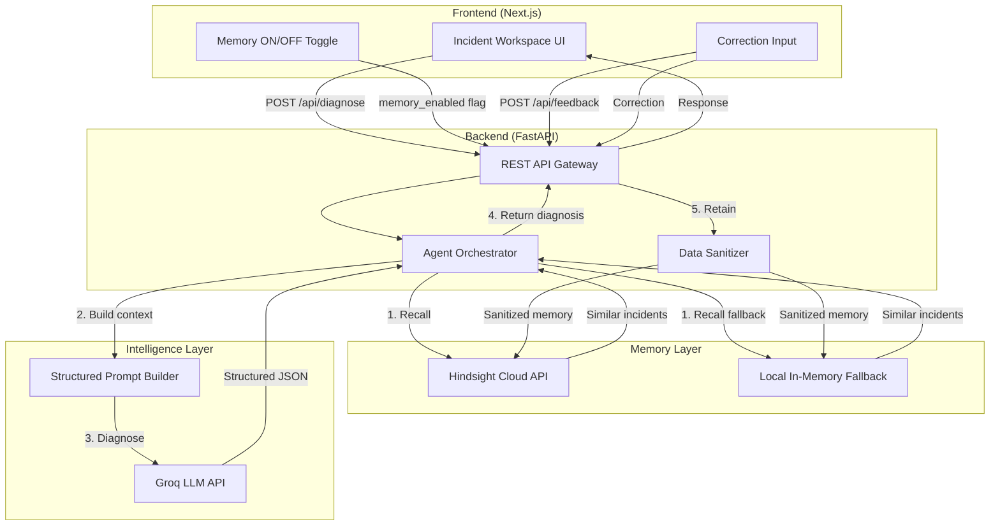
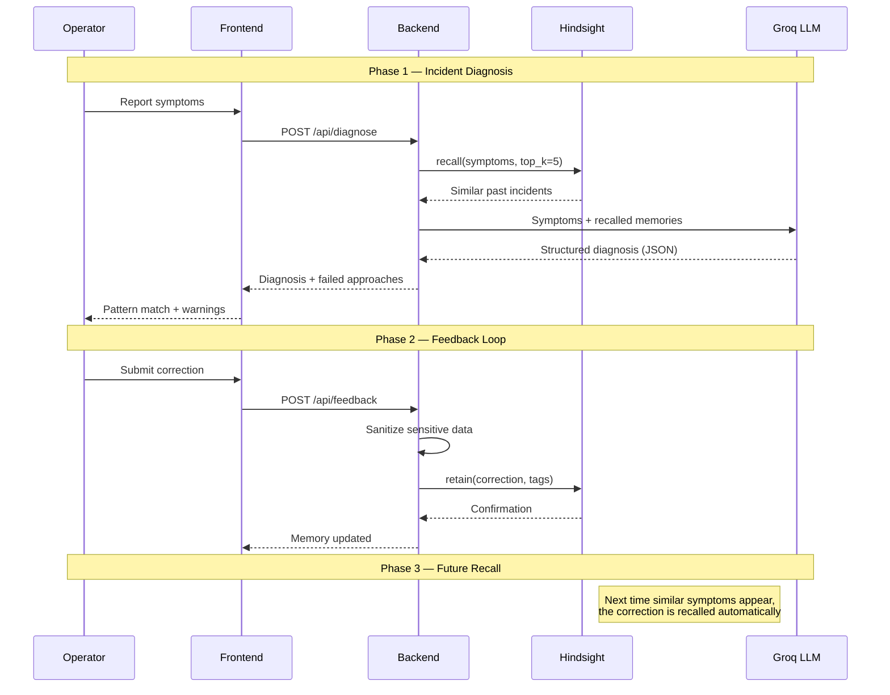
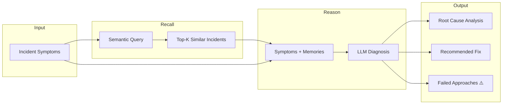
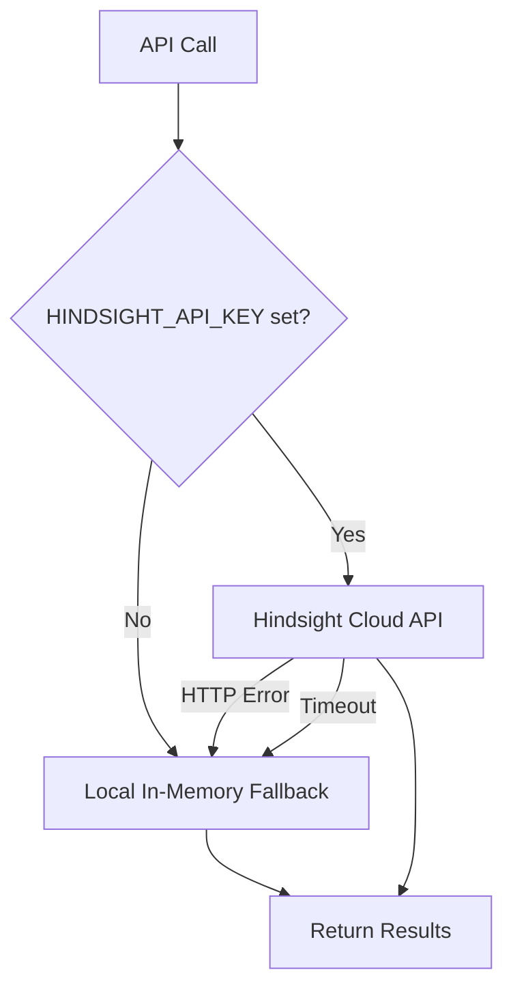

# Architecture & Memory Model

## System Overview

Incident Déjà Vu is a memory-first incident response agent. The architecture separates **reasoning** (LLM) from **memory** (Hindsight) to create a system that structurally improves with every resolved incident.

## Memory Lifecycle

The system implements a complete **Retain → Recall → Reason → Act → Learn** cycle:

## Component Architecture

### 1. Frontend (Next.js + React)
- **Single-page application** with a split-panel Incident Workspace
- **Memory Toggle** — ON/OFF switch to demonstrate Hindsight's value
- **Chat-style interface** — Operator reports symptoms, agent responds with diagnosis
- **Feedback panel** — Corrections are submitted directly to the retain pipeline

### 2. API Gateway (FastAPI)
- **`POST /api/diagnose`** — Core diagnosis endpoint; orchestrates recall → reason → respond
- **`POST /api/feedback`** — Correction loop; retains new learnings in memory
- **`POST /api/incidents/{id}/resolve`** — Marks an incident as resolved and retains experience
- **`GET /api/incidents`** — Lists all incidents (seed data + runtime)
- **`GET /api/health`** — Health check with version info

### 3. Agent Orchestrator (`llm_agent.py`)
- Formats recalled memories into structured LLM context
- Uses **Groq** with `llama-3.3-70b-versatile` for fast inference
- Forces **JSON output** via `response_format={"type": "json_object"}`
- Enforces structured fields: `pattern_match`, `confidence_score`, `failed_approaches`, etc.

### 4. Hindsight Client (`hindsight_client.py`)
- **`retain(incident, tags)`** — Converts structured data to narrative format for better recall quality
- **`recall(query, max_results)`** — Semantic search against historical incidents
- **Data sanitization** — Strips API keys, tokens, IP addresses before retention
- **Graceful fallback** — If no API key, uses local in-memory keyword matching

## Data Flow

## Data Model (Pydantic v2)

| Model | Purpose | Key Fields |
|-------|---------|------------|
| `Incident` | Active/resolved incident record | `id`, `title`, `description`, `status`, `severity`, `root_cause`, `failed_approaches` |
| `IncidentReport` | Incoming diagnosis request | `description`, `services`, `memory_enabled` |
| `ResolvedIncident` | Data retained in memory | `root_cause`, `resolution_steps`, `failed_approaches`, `time_to_resolve_mins` |
| `IncidentFeedback` | User correction | `incident_id`, `is_correct`, `correction` |
| `DiagnosisResult` | Structured LLM output | `pattern_match`, `confidence_score`, `similar_incidents`, `recommended_fix`, `failed_approaches` |

## Fallback Mechanism

If the `HINDSIGHT_API_KEY` is not present or the cloud API is unreachable, the `HindsightClient` gracefully falls back to an in-memory keyword-matching store. This ensures the demo **never crashes** due to environment configuration issues during a live presentation.

## Security Considerations

1. **Data Sanitization** — All incident data is sanitized before retention (API keys, tokens, IPs redacted)
2. **Environment Isolation** — Credentials stored in `.env`, excluded from version control
3. **HTTPS-only** — Hindsight API calls use TLS
4. **Graceful Degradation** — No data transmitted without valid credentials
5. **Input Validation** — Pydantic v2 enforces strict type validation on all API inputs

See [SECURITY.md](../SECURITY.md) for the full security policy.
